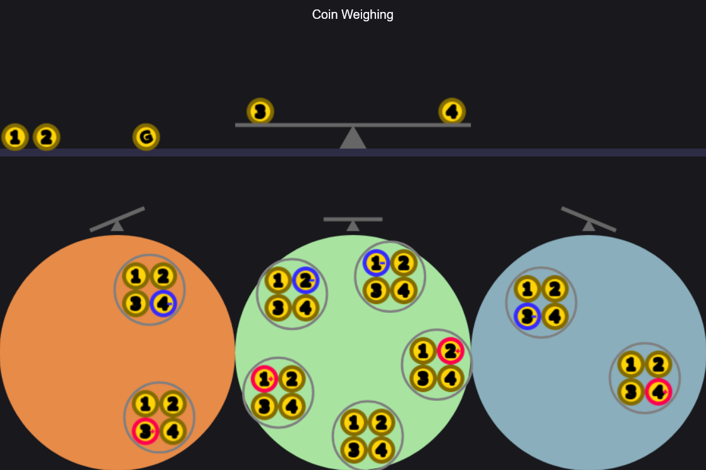

# Coin Weighing visualization

Try it at: https://yanamal.github.io/coin_weighing/coins.html

This is a simple visualization for a coin weighing puzzle:

You have four coins, and one of these coins might be the wrong weight. It might be either too light, or too heavy.
In addition, you have one known-good coin of the correct weight. The puzzle challenges you to deterimine which coin (if any) is the wrong weight, using as few weighings as possible on a balance scale.

The visualization helps demonstrate how *which coins you are weighing* affects the *possibilities* of which outcome you will see on the scale. On the top, there is a scale and you can drag coins on and off.
On the bottom, there are three areas corresponding to the three possibilities of what you will observe on the scale:

- left side is heavier
- the two sides have equal weight
- right side is heavier

There are also nine floating objects corresponding to the 9 possible world states, representing which coin (if any) is the wrong weight, and in which direction.

As you change which coins are on the scale, the nine possible world states move to be inside the corresponding "possible scale outcome" area.
(this only happens if there are an equal **number** of coins on the scale; otherwise, every time you were in the middle of re-arranging coins, there would be chaos as all world states would try to converge on one of the possible outcomes) 

Since the goal of the puzzle is to **minimize** the number of weighings, the idea is that each weighing would split the possible world states **as evenly as possible** into the three visible scale outcomes. 
So, a good weighing would split the 9 possible world states evenly into the three possible scale outcomes.

